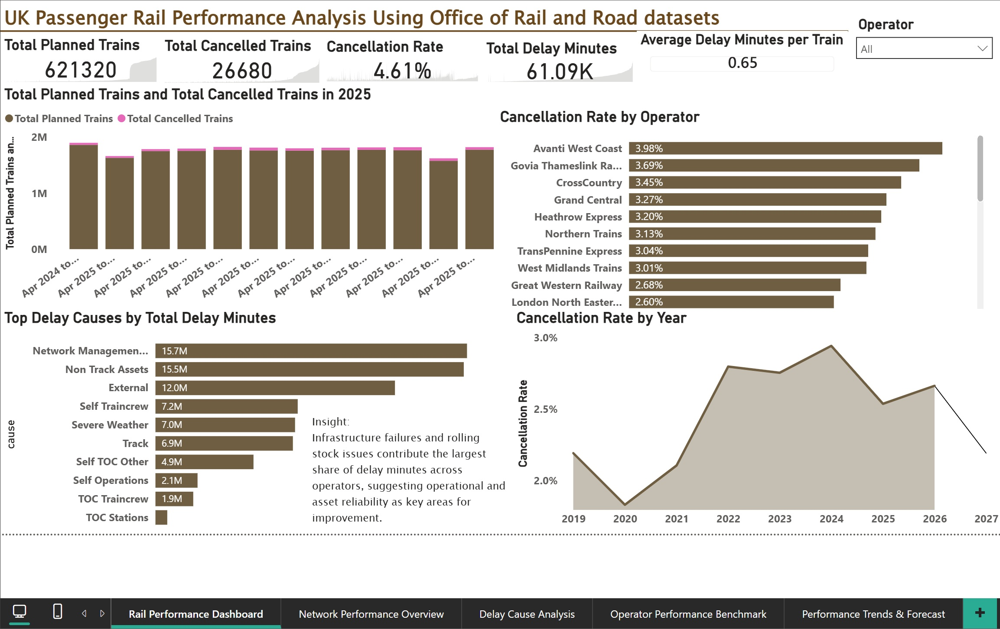
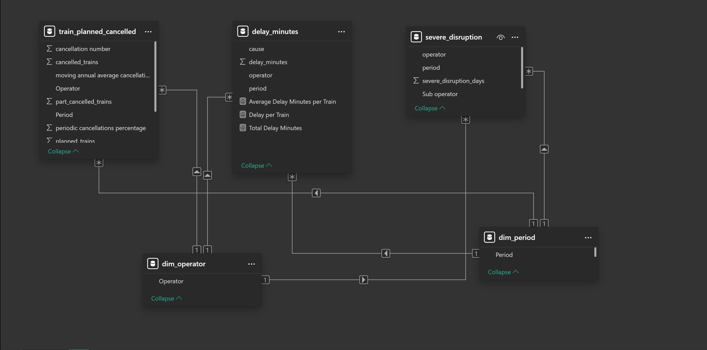

# UK-Rail-Passenger-Performance-Analysis

## UK Rail Passenger Performance Analysis
Interactive Power BI dashboard analysing UK rail service reliability, delay causes, and cancellation trends using Office of Rail and Road data.

This project explores passenger rail performance across UK train operators using publicly available data from the Office of Rail and Road (ORR). The objective is to analyse service reliability, delay patterns, and operational performance metrics through interactive data visualisation.

The project demonstrates how transport performance data can be structured and analysed using Power BI to support monitoring, reporting, and operational insights.

## View Interactive Dashboard

https://app.powerbi.com/links/BXZo3vN__T?ctid=bd697c1b-c481-479c-841e-c618542675c3&pbi_source=linkShare

---

## Project Overview

Rail service reliability is a key performance indicator for both rail operators and regulators. Delays and cancellations can significantly impact passenger experience and operational efficiency across the rail network.

This project analyses UK passenger rail performance data to identify patterns in cancellations, delays, and service reliability. An interactive Power BI dashboard was developed to allow users to explore performance metrics across train operators and time periods.

The dashboard focuses on operational performance indicators commonly monitored within the rail industry and demonstrates how data analytics can support performance monitoring and improvement initiatives.

---

## Business Questions

The analysis explores several key questions:

How has rail service cancellation performance changed over time?

Which train operators have the highest cancellation rates?

What are the most common causes of delay across the rail network?

How do delay minutes vary across operators and reporting periods?

---

## Data Source

The dataset used in this project comes from the Office of Rail and Road (ORR), the independent regulator responsible for monitoring rail performance across Great Britain.

The dataset includes operational metrics such as:

• Planned train services
• Cancelled services
• Cancellation rates
• Total delay minutes
• Delay causes across the rail network

These metrics are commonly used by rail operators, regulators, and performance analysts to monitor network reliability and operational performance.

---

## Data Model

The dataset was structured within Power BI using a relational data model to support efficient analysis and reporting. Performance metrics were aggregated and calculated using DAX measures to generate key indicators such as cancellation rates and average delay minutes per train.

This structured approach enables flexible filtering and cross-analysis across operators, years, and delay categories.

---

## Dashboard Features

The Power BI dashboard includes multiple pages designed to explore different aspects of rail performance.

Main dashboard highlights include:

• KPI indicators summarising total planned trains, total cancelled trains, cancellation rate, and total delay minutes
• Average delay minutes per train to provide context on service disruption levels
• Comparison of planned vs cancelled trains for 2025
• Top delay causes across the rail network
• Cancellation rate comparison across train operators
• Trend analysis of cancellation rates over time with forecast projection
• Interactive operator filtering using slicers

Additional dashboard pages explore deeper performance insights across operators, delay causes, and time trends.

---

## Key Insights

Several insights emerged from the analysis:

• Rail performance varies significantly between train operators, with some operators consistently showing higher cancellation rates.

• Infrastructure issues and operational faults contribute significantly to delay minutes across the network.

• Cancellation rates show fluctuations across reporting periods, indicating changing operational pressures within the rail network.

• Average delay minutes per train provides a clearer understanding of disruption levels relative to service volume.

---

## Business Recommendations

Based on the analysis, several potential operational insights can be considered:

• Monitoring cancellation trends across operators can help identify reliability issues and support targeted improvement initiatives.

• Analysing delay causes can help prioritise infrastructure maintenance and operational improvements.

• Tracking performance trends over time allows operators and regulators to evaluate the effectiveness of reliability improvement measures.

• Performance dashboards can support more effective monitoring and reporting for operational decision-making.

---

## Tools Used

Power BI

DAX

Data modelling

Data visualisation

---

## Skills Demonstrated

Power BI dashboard development

KPI reporting and performance monitoring

Data modelling and DAX calculations

Trend analysis and forecasting

Operational data analysis

---

## Project Motivation

Having previously worked within rail operations, this project reflects my interest in applying data analytics to understand and improve rail service reliability and operational performance.
